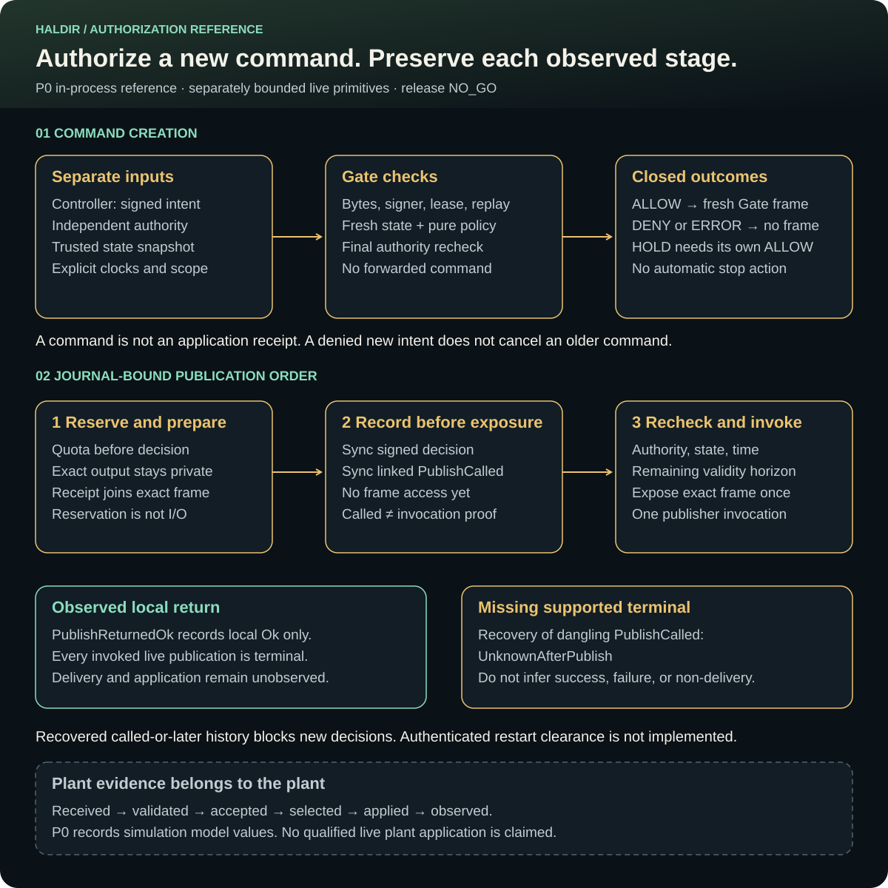

<p align="center">
  <picture>
    <source media="(prefers-color-scheme: dark)" srcset="assets/logo-dark.svg">
    
  </picture>
</p>

<p align="center"><a href="assets/archive/logos/README.md">Logo design archive</a></p>

# Haldir Gate

**Authorization for one new command, with evidence for each observed stage.**

Haldir is an experimental Rust reference monitor for mission-level plant commands.
It checks a signed controller intent against independently held authority, trusted state, replay history, and deterministic policy.
An allowed intent can produce a private frame under Gate's own output stream.
The publication path rechecks authority before exposing those exact bytes.
It never forwards the controller's command bytes.

The implemented `assurance-reference-v1` profile is an in-process software reference.
Its plant is a deterministic simulation model.
Release `0.9.0` remains **NO_GO**.
Haldir is not production ready, certified, airworthy, or qualified for physical deployment.

## Try the reference

Use Python 3.11 or newer and the exact Rust toolchain in [rust-toolchain.toml](rust-toolchain.toml).
Run from the repository root:

```bash
python3 -I -B tools/doctor.py
cargo test --locked -p haldir-range
cargo run --locked -p haldir-gate -- --build-info
```

The range exercises signed intents, Gate decisions, modeled commands, and the reference plant.
It needs no running NEST, CREBAIN, or Zenoh peer.
The `--build-info` command prints compiled metadata only.
The `haldir-gate` executable is an offline inspection tool, not a live daemon.

| Available surface | What it does | What it does not establish |
| --- | --- | --- |
| P0 `assurance-reference-v1` | In-process contract, authority, policy, command, and reference-plant checks | No neural execution, real transport, physical effects, or complete mediation |
| Package-bound startup | Verifies signed package roles and exact runtime identities before its declared effects | Authenticated artifact-root acquisition, running-image identity, protected credentials, or a mandatory production loader |
| `DeclaredLiveZenoh` library | Composes bounded ingress, one-owner processing, journal ordering, and a strict final-route publisher | An authenticated ongoing control plane, supervision, delivery, or plant application |
| Retained development smoke | Opens a disposable fixture, binds the aggregate, and immediately shuts it down | Intent processing or command publication; the recorded run performs zero of each |

[Assurance profiles](docs/ASSURANCE-PROFILES.md) define the exact scope.
P1, P2, and P3 remain unimplemented as complete compositions.

## How an intent becomes a command

<picture>
  <source media="(max-width: 640px)" srcset="assets/authorization-flow-mobile.svg">
  
</picture>

**Text alternative.** Gate validates bounded intent bytes, signature, scope, replay, and trusted-state freshness.
Its pure policy returns `ALLOW`, `DENY`, or `ERROR`.
Only `ALLOW` can reach fresh command construction and the final publication checks.
In the journal-bound composition, signed evidence is locally sync-confirmed before exact output bytes reach the publisher.
The plant owns its later receipt, application, and response observations.

[Wide SVG](assets/authorization-flow.svg) · [Mobile SVG](assets/authorization-flow-mobile.svg) ·
[Direct vector](https://raw.githubusercontent.com/sepahead/haldir/main/assets/authorization-flow.svg) ·
[Workflow and mathematics](docs/WORKFLOWS.md)

Open the direct vector in a browser when the repository preview is too small.
The [script-free HTML view](docs/authorization-flow.html) provides local Fit, 150%, and 300% reading controls.
The hosting application controls its own image zoom behavior.

### Decisions are different from actions

| Item | Meaning |
| --- | --- |
| `ALLOW` | The intent passes the decision checks; publication still requires the exact final recheck |
| `DENY` | No new Gate command is authorized |
| `ERROR` | No new Gate command is authorized because the decision path failed |
| `HOLD` | An explicitly allowed semantic action that produces a bounded zero-velocity command |
| `VELOCITY_LOCAL_NED` | An explicitly allowed velocity action in the admitted local north-east-down frame |

A denial does not cancel a previously published command.
It does not silently produce `HOLD` or an emergency-stop command.
Zero commanded velocity is not proof of physical stopping.
The [authority contract](docs/release/0.9.0/AUTHORITY-CONTRACT.md) owns these distinctions.

The native policy uses bounded state and checked fixed-point arithmetic.
It checks lease intersections, speed, measured-state acceleration, command slew, duty history, plant mode, and a prospective geofence.
Its geofence is a software authorization calculation, not a validated stopping-distance or vehicle-dynamics model.
The [architecture](docs/ARCHITECTURE.md#policy-and-motion-envelope) describes the exact envelope.

## Publication is not application

Haldir preserves separate facts: constructed, publish called, publish returned, received, validated, accepted, selected, applied, and observed.
A signed decision receipt proves neither delivery nor physical effect.
Reference-plant application events are simulation model values.

The journal-bound coordinator reserves logical evidence capacity before decision mutation.
It retains prepared bytes privately, syncs the signed decision and `PublishCalled`, then repeats the authority, state, time, and horizon checks.
Only then can the publisher receive that exact frame once.

A local publisher `Ok` means only that the transport call returned `Ok`.
Every invoked declared-live publication is terminal, including local success.
The pinned wire starts command validity at plant-local arrival, which this Gate path does not observe or bound.
It therefore cannot infer an application interval or safely authorize a following command.

A recovered dangling `PublishCalled` becomes `UnknownAfterPublish`.
That record does not prove whether the transport call began, delivered, or applied anything.
Recovered called-or-later history blocks new decisions.
Elapsed time does not clear it, and no authenticated restart-clearance API exists yet.

These ordering properties belong to the journal-bound composition.
The reusable actor alone does not supply its durable journal.
Read [evidence semantics](docs/EVIDENCE-SEMANTICS.md) for exact cancellation, storage-failure, and recovery limits.

## Optional ecosystem relationships

Haldir can exercise its P0 reference without other ecosystem processes.
The optional exact adapter retains NCP `v0.8.0` at
`2f5bd586d4bb20c90362bb6f5698b7f64057ba4e`, wire `0.8`, contract `d1b50a2d8a265276`.
Its default adapter uses modeled bytes.
The off-by-default `real-ncp` feature validates exact compact JSON against that pinned upstream crate.

| Project or input | Intended role | Current Haldir boundary |
| --- | --- | --- |
| [NCP](https://github.com/sepahead/NCP) | Typed command and transport contract | Exact retained wire-0.8 adapter; no qualified native-local gate |
| [Engram (private source)](https://github.com/sepahead/Paper2Brain) / NEST | External signed-intent controller | Private repository access is required. No integrated neural producer or behavioral backend-conformance result |
| [CREBAIN](https://github.com/sepahead/crebain) | External plant and application owner | No qualified Haldir plant-side integration or actuator-bypass closure |
| [Galadriel](https://github.com/sepahead/galadriel) | Prospective advisory evidence producer | No runtime edge; a verdict cannot grant or widen authority |
| PID evidence | Possible research input under a future admitted contract | No decision override or authority source |
| [Prisoma](https://github.com/sepahead/prisoma) | Possible external experiment or evidence consumer | No qualified Haldir experiment or export adapter |

The earlier fixed-role NCP reference experiment uses direct execution and excludes Haldir gating.
A requested gated selection must fail before any endpoint is prepared.
It must not fall back to direct execution.
Local digest checks are not Haldir signatures or authenticated controller intents.

That reference experiment's acceleration actions cannot be copied into Haldir's velocity fields.
A new profile needs explicit units, frames, action mapping, authority, and application evidence.
The [local compatibility boundary](docs/NCP-COMPATIBILITY.md#candidate-local-ncp-boundary) owns that requirement.
It also distinguishes the current modular CREBAIN body target from Haldir's velocity command.

The August 10, 2026 inspection recorded a different, unreleased NCP `1.0.0-rc.1` candidate at
`1ffd3bf9a6c52d0279eb31a56e0664e4eec24d68`.
That release-blocked historical observation is not Haldir's runtime dependency.
Native migration and independent qualification remain **NOT RUN**.

## Development and evidence

```bash
just fmt-check
just lint
just test-all
just doc-test
just ci
```

`just ci` runs the complete local P0 gate.
Its current-head audit verifies an exact committed subject; a green working-tree run does not sign or publish later changes.
The separately pinned TLA+ campaign uses `just formal-offline` after its verified tool cache exists.
Ordinary Rust commands and the doctor do not invoke Java.
The [contributing guide](CONTRIBUTING.md) owns full verification and signed delivery requirements.

The doctor uses bounded shell-free probes and never installs a Rust toolchain.
Only its Cargo workspace-resolution probe promises locked offline behavior.
Ordinary Cargo and dependency-policy commands can acquire missing inputs or refresh advisories.
Use explicitly named offline lanes when network independence is required.

Every load-bearing claim has a `CL-*` entry in the [claim ledger](docs/CLAIM-LEDGER.md).
Synthetic router ACL tests, bounded formal models, reference-plant tests, and development smoke each have separate evidence limits.
None supplies a complete authenticated deployment shell, protected credential custody, or physical-plant qualification.

| Read next | Purpose |
| --- | --- |
| [Workflow guide](docs/WORKFLOWS.md) | Command decisions, numeric examples, and publication evidence |
| [Architecture](docs/ARCHITECTURE.md) · [Authority graph](docs/AUTHORITY-GRAPH.md) | Owners, state, policy, and side-effect boundaries |
| [Evidence semantics](docs/EVIDENCE-SEMANTICS.md) · [Evidence index](evidence/README.md) | Exact observed stages and retained campaigns |
| [Limitations](docs/LIMITATIONS.md) · [Roadmap](docs/ROADMAP-STATUS.md) | Unimplemented deployment and research work |
| [NCP compatibility](docs/NCP-COMPATIBILITY.md) | Pins, conversion, and unsupported profiles |
| [Current-head qualification](release/0.9.0/current-head/README.md) | Current `NO_GO` program and historical lineage |
| [Agent contract](AGENTS.md) · [Contributing](CONTRIBUTING.md) | Maintainer instructions and protected delivery rules |

Dual-licensed under [Apache-2.0](LICENSE-APACHE) or [MIT](LICENSE-MIT), at your choice.
