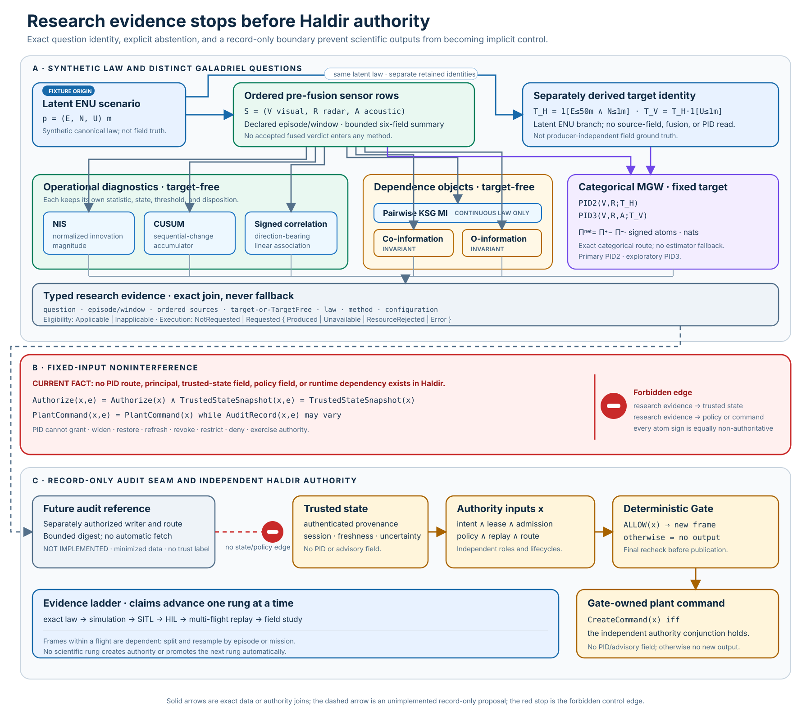

<p align="center">
  <picture>
    <source media="(prefers-color-scheme: dark)" srcset="assets/logo-dark.svg">
    
  </picture>
</p>

# Haldir Gate

Haldir is an experimental, backend-aware authorization reference monitor for
mission-level plant commands. A controller signs a typed semantic intent; Gate
independently verifies authority and scope, correlates the intent with trusted
state, evaluates deterministic bounded policy, and—only after a final
recheck—constructs a new plant-facing NCP command under Gate's own output
stream. Controller command frames are never forwarded.

```text
signed controller intent ──> Haldir Gate ──> Gate-owned NCP command
                                  ▲
                      authority + trusted state
```

> [!WARNING]
> Haldir is a research implementation. It is not production ready, certified,
> airworthy, or safe for operational deployment. Release `0.9.0` remains
> `NO_GO`. The repository does not yet contain the mandatory authenticated
> deployment shell, protected credential custody, complete actuator-bypass
> inventory, or physical-plant evidence required for a deployment claim.

Start with the [architecture](docs/ARCHITECTURE.md). The
[claim ledger](docs/CLAIM-LEDGER.md) is the authority for what evidence proves;
the [limitations](docs/LIMITATIONS.md) and
[roadmap](docs/ROADMAP-STATUS.md) state what remains open.

## Implemented scope

| Composition | Implemented | Explicit boundary |
| --- | --- | --- |
| `assurance-reference-v1` | End-to-end in-process signed-intent, Gate actor, modeled NCP frame, and deterministic reference-plant path | No network, neural runtime, physical plant, or complete-mediation claim |
| `DeclaredLiveZenoh` library path | Durable startup/journal binding, route-bound activation, bounded exact ingress, single-owner state/intent processing, strict final-route publication, and local shutdown | No production daemon, authenticated control/state producer, supervision, protected secret loader, or delivery/application proof |
| Package-bound Gate startup | Strict signed-package verification, bounded exact artifact capture, signed-role NCP validation, strict Gate configuration, four separately verified, role-separated, public-key-distinct runtime-snapshot approvals rooted in the same retained bootstrap trust, cross-store rejection of incompatible `kid` or public-key reuse, exact live-object matching, an atomic deployment-revision/boot ratchet, and signed journal-ID enforcement when binding the format-v2 evidence chain | Role/key separation does not prove independent organizations or operators; seven artifact roles remain byte-only; no authenticated artifact-root, running-binary, protected-credential, mandatory-journal, or production-runner proof |

Galadriel's PID and mutual-information research remains outside every Haldir
authority input. The current design has no PID route, principal, policy field, or
runtime dependency, and PID cannot enter `TrustedStateSnapshot`, grant, revoke,
restrict, or deny. A future evidence-only reference would require a new,
separately reviewed schema and separately authorized audit writer; only its audit
record may vary, and it would still have no policy or command capability
(`CL-PID-RECORD-BOUNDARY-01`).

[](docs/assets/galadriel-pid-advisory-boundary.svg)

[The Galadriel PID advisory contract](docs/GALADRIEL-PID-ADVISORY-CONTRACT.md)
defines the fixed-target categorical MGW study, method-eligibility matrix,
authority noninterference equation, reality-facing evidence ladder, twenty-lens
review, and complete future-work boundary.

The `haldir-gate` executable is intentionally an offline introspection tool. The
live examples provision or open a disposable development fixture and can bind
then immediately shut down while processing zero intents. They are evidence
fixtures, not deployment runbooks.

## Quickstart

The local development lane requires Git, Python 3.11 or newer, and the exact
Rust toolchain in `rust-toolchain.toml`:

```bash
python3 -I -B tools/doctor.py
cargo fmt --all -- --check
cargo clippy --workspace --all-targets --all-features --locked -- -D warnings
cargo test --workspace --all-targets --all-features --locked
cargo test --workspace --doc --all-features --locked
```

If [`just`](https://github.com/casey/just) is installed, the corresponding
recipes are:

```bash
just doctor
just fmt-check
just lint
just test-all
just doc-test
```

The doctor uses shell-free probes with hard time, output, and process-group
bounds. With `rustup`, it selects the already-installed declared toolchain using
non-installing `rustup run`; it never requests toolchain acquisition. Only Cargo
workspace resolution is promised locked and offline. Optional checks report
`cargo-deny` and the GitHub CLI. The ordinary doctor and all normal Rust
build/test commands do not invoke Java.

`just ci` is the full local P0 candidate gate, not the fast edit loop.
It includes the immutable current-head audit and deliberately rejects an
unqualified source head until a reviewed audit cut is activated. Java is used
only by the separate TLA+ model checker. `just doctor-formal` adds a preliminary
Java-major probe; the formal runner itself verifies the exact vendor, runtime,
architecture, jar, and model inputs. Use `just formal-offline` with the verified
cache or the pinned hosted formal workflow. Cargo may acquire missing
locked dependencies, and the ordinary local `cargo deny` lane may refresh its
advisory database; only the explicitly named offline lanes claim network
independence.

For bounded hostile-byte parser properties and named malformed regressions, run
`just parser-property-smoke`. This is not coverage-guided fuzzing; the historical
`just fuzz-smoke` recipe is only a compatibility alias.

See [CONTRIBUTING.md](CONTRIBUTING.md) for repository discipline and evidence
rules.

## Safety architecture

The central invariant of the implemented Gate decision path is:

```text
no Gate-authored plant command unless
    Gate is active and non-faulted
  ∧ the exact intent bytes authenticate to the leased controller
  ∧ route, boot, session, vehicle, mission, lease, admission, and policy agree
  ∧ the intent and trusted-state positions are fresh and bounded
  ∧ deterministic policy returns ALLOW
  ∧ authority, state, time, and publication horizon still agree at exposure
  ∧ the exact final route and fresh Gate output position are authorized
```

In the journal-bound coordinator, prepared output bytes remain private until the
signed decision and `PublishCalled` boundary are locally sync-confirmed and the
actor repeats every safety-relevant check. A failure before exposure makes no
exact frame available to a publisher, although a private prepared frame may
already exist. A failure after `PublishCalled` cannot prove non-delivery, so
that composition's restart recovery classifies it as `UnknownAfterPublish` and
blocks new decisions pending authenticated external clearance. The reusable
public actor API has no durable-journal guarantee by itself.

Haldir keeps these facts distinct: *constructed*, *published call returned*,
*received*, *validated*, *accepted*, *selected*, *applied*, and *observed*. A
local publisher `Ok` proves none of the downstream stages. The declared-live
path therefore stops after any publication invocation—even local `Ok`—because
NCP v0.8 begins TTL at plant-local arrival and Gate has no bounded-delivery or
application-acknowledgement evidence from which to reconstruct that interval.

The native policy uses fixed-point checked arithmetic and bounded state. It
checks fresh trusted state, lease/policy intersections, scalar and vector speed,
measured-state acceleration, published-command slew, exact half-open duty
interval arithmetic with conservative retained-future-tail and bounded-history
over-approximation, continuous-motion/Hold dwell, action-specific plant-mode
rules, and a conservative prospective geofence.
That software envelope is not a validated vehicle-dynamics or stopping-distance
model.

## NCP boundary

Haldir remains pinned to the annotated NCP `v0.8.0` tag at commit
`2f5bd586d4bb20c90362bb6f5698b7f64057ba4e` (wire `0.8`, contract hash
`d1b50a2d8a265276`). The default adapter uses deterministic modeled bytes; the
off-by-default `real-ncp` feature builds and validates exact compact JSON with
the pinned upstream crate.

As observed on 2026-08-10 at NCP `main`
`1ffd3bf9a6c52d0279eb31a56e0664e4eec24d68`, upstream `main` is an unreleased,
release-blocked `1.0.0-rc.1` candidate using wire `1.0`; it is not Haldir's
runtime dependency. Haldir's native wire-1.0 migration and independent
qualification are not run. See [NCP compatibility](docs/NCP-COMPATIBILITY.md)
for exact pins and projection limits.

## Workspace

| Area | Responsibility |
| --- | --- |
| `haldir-contracts`, `haldir-crypto` | Canonical contracts, typed identity, COSE/Ed25519, trust, and revocation |
| `haldir-state`, `haldir-core`, `haldir-admission` | Replay, authority, immutable decision snapshots, and controller/backend admission |
| `haldir-policy-native` | Pure deterministic authorization policy and bounded publication history |
| `haldir-ncp08`, `haldir-transport-zenoh` | Closed NCP construction, strict routes, bounded ingress, and typed publication |
| `haldir-evidence`, `haldir-durable` | Signed publication journal, authenticated state, anchors, and atomic storage primitives |
| `haldir-gate` | One-vehicle actor, startup, lifecycle, and live ownership composition |
| `haldir-reference-plant`, `haldir-range` | Simulation-only receiver/application model and adversarial in-process scenarios |
| `haldir-deployment` | Signed deployment-package, owned-artifact, NCP-pin, and strict Gate-configuration verification primitives |
| `tools/haldir-ctl`, `tools/` | Offline inspection, compatibility, verification, and evidence tooling |

Dependencies point toward contracts and pure state. Transport and the reference
plant never decide authority; Gate composes them at explicit side-effect
boundaries. The detailed crate and lifecycle diagrams are in
[docs/ARCHITECTURE.md](docs/ARCHITECTURE.md).

## Evidence and release truth

Every load-bearing public claim has a `CL-*` entry and an evidence pointer in
the [claim ledger](docs/CLAIM-LEDGER.md). Green unit tests establish only their
declared local properties. The bounded TLA+ model, synthetic Zenoh ACL campaign,
development bind/shutdown campaign, and reference plant each have deliberately
narrow claim boundaries.

The next architecture milestone is one private authenticated deployment shell
that consumes the verified package, binds the running binary/configuration and
durable identities, opens the sole protected final-route credential, authenticates
control and state producers, runs the single-owner service under bounded
supervision, and performs authenticated restart clearance. Production claims
remain false until that shell and plant-side bypass closure are evidenced.

## Key documents

- [Architecture](docs/ARCHITECTURE.md)
- [Architecture decision records](docs/adr/README.md)
- [Claim ledger](docs/CLAIM-LEDGER.md)
- [Assurance profiles](docs/ASSURANCE-PROFILES.md)
- [Limitations](docs/LIMITATIONS.md)
- [Threat model](docs/release/0.9.0/THREAT-MODEL.md)
- [Evidence semantics](docs/EVIDENCE-SEMANTICS.md)
- [Galadriel PID advisory boundary](docs/GALADRIEL-PID-ADVISORY-CONTRACT.md)
- [NCP compatibility](docs/NCP-COMPATIBILITY.md)
- [Release migration guide](docs/release/0.9.0/MIGRATION.md)
- [Roadmap status](docs/ROADMAP-STATUS.md)

## License

Dual-licensed under [Apache-2.0](LICENSE-APACHE) or [MIT](LICENSE-MIT), at your
option.
