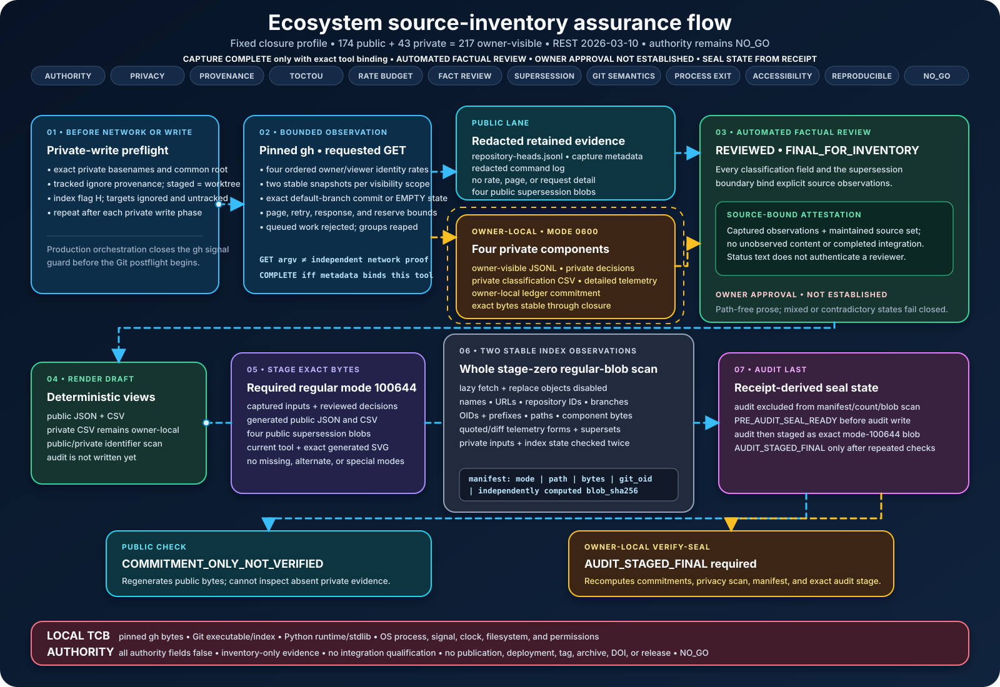

# Source ledger (P0 baseline)

Recorded for the P0 deliverable. The specification requires re-running the full
organization inventory before any integration release; that (and the private
owner-visible inventory) is out of P0 scope.

## Haldir

- repository: `git@github.com:sepahead/haldir.git`
- base branch: `main` (completion re-audit baseline `2a55f3d` on 2026-07-13)
- work branch: `main`

## NCP baseline (immutable, pinned)

- tag: `v0.8.0`
- commit: `2f5bd586d4bb20c90362bb6f5698b7f64057ba4e`
- wire: `0.8`; contract hash: `d1b50a2d8a265276`
- `proto/ncp.proto` sha256: `6f13b12cff76e12fef384f691d11e2944db1f676568c3e780d3f975689131227`
  (measured locally 2026-07-12 from the tagged worktree)
- capability profile: `PRE_AUTHORITY_ACL_ONLY`
- current upstream `main` observed during the 2026-07-13 re-audit:
  `205384508d619923e05aef192bedaeb57cf665fc`; the two post-tag commits affect
  release/consumer-pin metadata, not the immutable v0.8.0 wire baseline.

## Toolchain

- rustc/cargo `1.96.0`, edition 2024, `forbid(unsafe_code)`.
- crypto: `ed25519-compact` 2.2, `sha2` 0.10, `zeroize` 1, `subtle` 2, `getrandom` 0.2.
- test: `proptest` 1. All available offline in the reviewed cache.

## Consumer repositories (recorded, not audited in P0)

Crebain, Galadriel, Prisoma, pid-rs, Engram, Manwe, Cortexel, and the atlas/data
repositories are present in the local workspace but are **not** part of the P0
trusted computing base and were not audited or modified here (see
`docs/LIMITATIONS.md`). The specification's `repository-classification.csv` and the
full inventory are release-gate deliverables, out of P0 scope.

## Current bounded source-inventory workflow (2026-08-03)

The P0 entries above remain dated history. The current workflow does not replace
that history or infer an integration from a copied protocol file. Haldir remains
pinned to immutable NCP `v0.8.0`. NCP repository HEAD is the unreleased and
release-blocked `1.0.0-rc.1` candidate on wire `1.0`; Haldir's native-1.0 migration
and independent role qualification remain **NOT RUN**.

Long description: The diagram shows a seven-stage fail-closed workflow under 12
review lenses. It distinguishes conditional capture completion, automated factual
review, owner approval that is **NOT ESTABLISHED**, and receipt-derived seal states.
A private-write preflight verifies tracked and staged-equal ignore
provenance before bounded requested-GET capture. The configured production profile
expects 174 public and 43 private repositories, 217 owner-visible repositories in
total. Those counts are operator closure assertions; they do not prove that a
credential can see every private repository. Public, redacted evidence and four
owner-local mode-0600 components remain on separate lanes. Explicit reviewed decisions
with `REVIEWED` and `FINAL_FOR_INVENTORY` status declare captured observations plus
the exact maintained source IDs used for review. The final audit co-binds those decision
bytes, four public supersession source blobs, and one separately bound owner-local ledger
commitment. The draft public products, current tool source, and exact generated SVG are
staged as mode-100644 regular files. Two stable stage-zero index observations surround a
bounded whole-index privacy scan. The resulting canonical manifest binds mode, path,
byte count, Git object ID,
and an independently computed blob SHA-256. The audit is excluded from that manifest,
written last, staged exactly, and checked again. A public check can verify only the
committed private digest. The owner-local `verify-seal` path also requires the final
staged audit and the private input bytes. Animated dots only show the order of flow;
the reduced-motion view retains every arrow and all information.

Exact decision status, attestation text, reviewer text, dates, and source digests do
not authenticate a reviewer or prove that a person completed review. The supersession
source records an `AUTOMATED_FACTUAL_REVIEW`; it explicitly leaves reviewer-identity
authentication and owner approval false. The retained machine-readable capture and
audit artifacts—not this diagram or prose—control whether the exact-tool capture and
final seal passed. A public check remains commitment-only. Owner-local `verify-seal`
and explicit owner approval are separate scopes.

The diagram and its deterministic checks are workflow evidence only. They do not
show that a production capture ran, that a private review passed, or that any
integration, deployment, publication, tag, archive, DOI, or release is authorized.
All authority fields remain false and the release decision remains `NO_GO`.
Native NCP 1.0 migration, independent role qualification, live external security
gates, performance/endurance gates, signatures/provenance, and release publication
remain **NOT RUN**.
